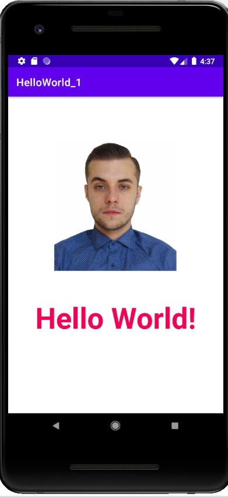

# HelloWorld_1
First project build in Android Studio.
## Whats new:
1. Created first app in studio.
2. Created virtual device.
3. Added resource.
4. Work with layout.
5. Find out app structure.
6. HelloWorld app builded and ran in virtual device.

