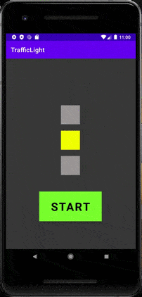

# Activity_2
First project build in Android Studio.
## What was done or new for me:
1. Worked with variables, types and their view aria.
2. If-else, switch-case, try-catch constructions learned.
3. Worked with resources and layout.
4. Worked with onClick() listener.
5. Simple traffic light app created.

